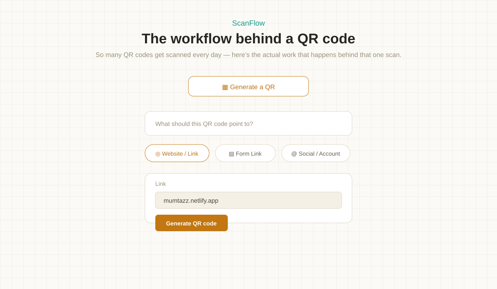
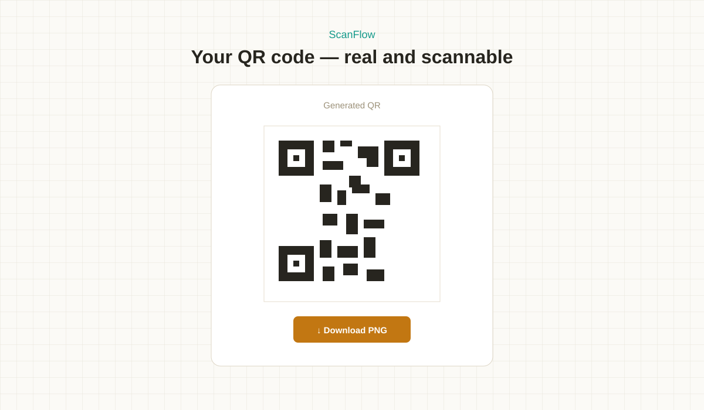
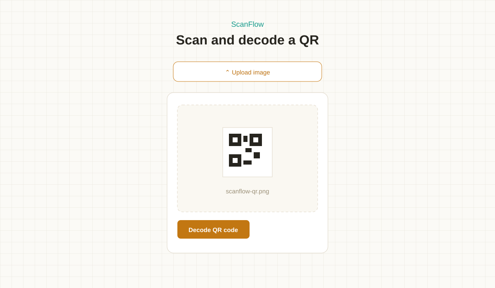
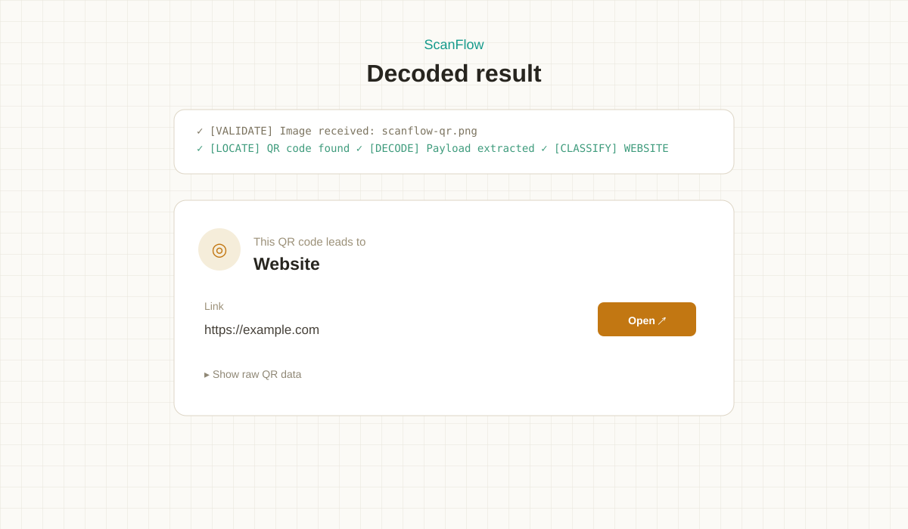
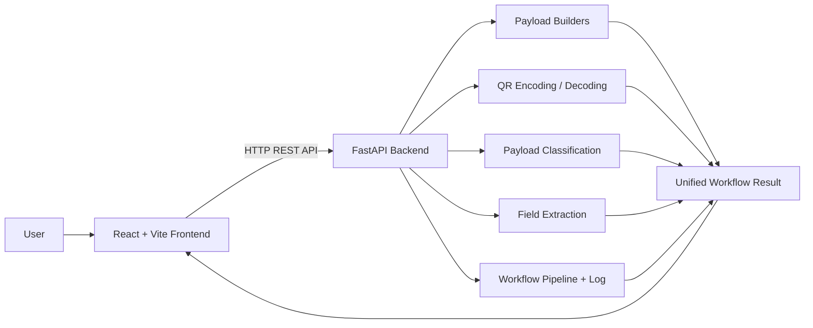

# ScanFlow

> **The workflow behind a QR code.**

ScanFlow is a web-based QR workflow analyzer and builder that makes the logic behind QR codes visible. Instead of treating **Generate** or **Scan** as a black box, it exposes the processing stages used to build a payload, encode a real QR image, decode QR data, classify the target, and extract structured fields.

[](https://react.dev/)
[](https://fastapi.tiangolo.com/)
[](https://www.python.org/)
[](https://opencv.org/)
[](https://vite.dev/)

---

## Overview

QR applications usually hide the transformation between **structured information** and the final QR image.

ScanFlow makes that transformation inspectable.

- **Generate:** structured input → standard payload → QR image → round-trip verification
- **Decode:** QR image/text → payload → target classification → structured fields

The backend returns a unified workflow result containing the direction, QR type, status, duration, pipeline stages, activity log, payload, extracted fields, and generated QR image when applicable. The React frontend then presents that result as a visual workflow.

## Why ScanFlow?

A QR code is more than an image. It is an encoded representation of a payload that can follow different conventions depending on its purpose.

ScanFlow focuses on that layer:

> **What is actually inside the QR, and what happens between the input and the final result?**

The project separates:

1. **Payload construction**
2. **QR encoding / decoding**
3. **Payload classification**
4. **Field extraction**
5. **Workflow presentation**

This keeps the QR processing logic in the backend while the frontend focuses on making the process understandable.

## Core Capabilities

| Capability | Implementation |
|---|---|
| QR Generation | Builds a payload and creates a real PNG QR image |
| QR Decoding | Reads uploaded QR images using OpenCV |
| Text Decoding | Accepts pasted QR payload text directly |
| Payload Builders | Dedicated builders for Link, WiFi, Contact, and UPI |
| Payload Parsing | Converts decoded raw payloads into structured fields |
| Target Classification | Distinguishes Website, Form, Social, WiFi, Contact, UPI, or Text |
| Round-Trip Verification | Decodes a generated QR and compares it with the original payload |
| Workflow Pipeline | Exposes ordered processing stages and their status |
| Activity Log | Records processing events and their outcome |
| Field Extraction | Extracts useful fields such as URL, SSID, contact details, or UPI data |

## Supported QR Payloads

ScanFlow uses standard payload representations rather than a proprietary QR format.

| Type | Payload | Standard representation |
|---|---|---|
| Website / Link | URL | `https://...` |
| Form Link | URL classified from known form domains | `https://...` |
| Social / Account | Profile URL classified from known social domains | `https://...` |
| WiFi Network | Network configuration | `WIFI:T:...;S:...;P:...;H:...;;` |
| Contact Card | Contact information | vCard 3.0 |
| UPI / Payment | Payment target | `upi://pay?...&cu=INR` |

### Classification detail

Website, Form, and Social are currently identified through domain-based rules. The application does **not** use an ML model or semantic classifier for this step.

## 📸 ScanFlow in Action

> Screenshot paths currently point to the repository existing SVG assets. PNG replacements can be connected here once the final screenshots are uploaded.

### Generate Workflow



### Generated QR



### Scan & Decode



### Decoded Result



## How It Works

### 1. Generate Pipeline

```text
User Input
    ↓
Validate Details
    ↓
Build Standard Payload
    ↓
Encode QR Image
    ↓
Decode Generated Image
    ↓
Compare Payloads
    ↓
Ready to Download
```

The verification stage is an actual round trip:

```text
payload → PNG QR → OpenCV decode → decoded payload
```

The generated result is marked verified when the decoded payload matches the original payload exactly.

### 2. Decode Pipeline

```text
QR Image / Pasted Text
        ↓
     Read Input
        ↓
    Locate QR Code
        ↓
   Decode Payload
        ↓
  Classify Target Type
        ↓
    Extract Fields
        ↓
    Reveal Target
```

When an image is uploaded, OpenCV performs the image-to-payload step. When text is pasted directly, image location is skipped and the supplied payload is parsed.

## Architecture



### Separation of responsibilities

| Layer | Responsibility |
|---|---|
| React frontend | Input forms, workflow visualization, result presentation |
| FastAPI API | Request handling and workflow orchestration |
| Payload builders | Construct standard QR payload strings |
| QR image module | PNG generation and OpenCV decoding |
| Parser | Detect QR type and extract structured fields |
| Pipeline utilities | Consistent stages, statuses, logs, and result shape |

## Technical Implementation

### Standard Payload Builders

The backend uses dedicated builders for the supported generated formats:

- **Link** → normal URL
- **WiFi** → standard `WIFI:` payload with required character escaping
- **Contact** → vCard 3.0
- **UPI** → `upi://pay` with UPI ID, optional payee name, amount, and INR currency

The builders validate required input before producing the payload.

### QR Encoding

ScanFlow uses the Python `qrcode` package to generate a real PNG QR image.

The generated image is returned to the frontend as a Base64 data URL.

### QR Decoding

Uploaded image bytes are converted into an OpenCV image and processed with:

```python
cv2.QRCodeDetector()
```

### Payload Parsing

The parser identifies structured formats using their payload signatures:

- `WIFI:`
- `BEGIN:VCARD`
- `upi://`
- URL / domain patterns
- otherwise → `TEXT`

For recognized formats, ScanFlow extracts fields instead of returning only the raw payload.

### Unified Workflow Result

Both generation and decoding use the same result structure:

```text
direction
qr_type
status
duration_ms
pipeline
log
payload
fields
qr_image
```

This allows the frontend to render both workflows through a consistent model.

## Workflow Engine

The backend represents each operation as an ordered pipeline.

### Generate stages

```text
validate → build → encode → verify → ready
```

### Decode stages

```text
validate → locate → decode → classify → extract → reveal
```

Each stage can be marked as pending, active, done, or error. Additional details can be attached to individual stages.

The activity log records processing messages with a stage, message, level, and timestamp.

## Frontend Workflow Experience

The frontend does not reproduce QR-processing logic itself.

1. React sends the request to FastAPI.
2. FastAPI performs the actual processing.
3. The backend returns the structured workflow result.
4. React reveals the returned stages progressively for the visual experience.

This keeps the processing logic centralized while allowing the UI to present the workflow clearly.

## API

The QR API is exposed under:

```text
/api/qr
```

| Method | Endpoint | Purpose |
|---|---|---|
| POST | `/api/qr/generate` | Build and generate a QR |
| POST | `/api/qr/decode` | Decode an uploaded QR image or supplied text |

FastAPI interactive API documentation is available locally at `http://127.0.0.1:8000/docs`.

## Tech Stack

| Layer | Technology |
|---|---|
| Frontend | React 18 + Vite 5 |
| Routing | React Router |
| UI / Motion | Tailwind CSS + Framer Motion |
| Icons | Lucide React |
| Backend | FastAPI 0.115 |
| Language | Python |
| Validation | Pydantic |
| QR Generation | qrcode |
| QR Decoding | OpenCV |
| Numerical Image Handling | NumPy |
| API | REST |

## Project Structure

```text
scanflow/
├── backend/
│   ├── app/
│   │   ├── api/
│   │   │   └── qr_routes.py
│   │   ├── qr/
│   │   │   ├── parser.py
│   │   │   ├── payloads.py
│   │   │   └── qr_image.py
│   │   └── utils/
│   │       └── pipeline.py
│   └── requirements.txt
│
├── frontend/
│   ├── src/
│   └── package.json
│
├── docs/
│   └── screenshots/
│
└── README.md
```

## Run Locally

### Backend

```bash
cd backend
python -m venv .venv
```

Windows PowerShell:

```powershell
.\.venv\Scripts\Activate.ps1
```

Install dependencies:

```bash
python -m pip install -r requirements.txt
```

Start the API:

```bash
python -m uvicorn app.main:app --reload --port 8000
```

### Frontend

Open another terminal:

```bash
cd frontend
npm install
npm run dev
```

Then open `http://localhost:5173`.

## Example Processing Log

### Generate

```text
[VALIDATE] All required details look good
[BUILD]    Payload string built
[ENCODE]   QR image generated
[VERIFY]   Scanned the generated image back — payload matches exactly
[READY]    Your QR code is ready to download
```

### Decode

```text
[VALIDATE] Image received
[LOCATE]   QR code found in image
[DECODE]   Payload extracted
[CLASSIFY] This looks like a WEBSITE QR code
[EXTRACT]  Fields parsed
[REVEAL]   Target revealed
```

## Safety & Behavior Notes

- ScanFlow reads QR payloads; it does not automatically open or fetch the destination.
- UPI QR generation creates a payment link. ScanFlow does not process payments.
- WiFi QR parsing extracts the encoded network information but does not connect the device to the network.
- A decoded QR payload should still be reviewed before opening its destination.
- Form and Social classification is based on known domain lists, not a security or ML risk assessment.

## Current Limitations

The current implementation keeps the scope focused on QR payload processing.

Not currently implemented:

- live camera scanning
- persistent scan history
- authentication
- destination fetching
- malicious/suspicious QR detection
- ML-based target classification
- broad QR format coverage beyond the implemented parsers/builders

## Roadmap

Potential future extensions include:

- Camera-based live QR scanning
- Scan history and persistence
- Additional QR payload formats
- Suspicious URL analysis
- Payload validation and sanitization
- Detailed QR metadata inspection
- Exportable scan reports
- Authentication and user-specific history

## Engineering Highlights

ScanFlow demonstrates several practical engineering patterns:

- **Separation of concerns** between React presentation and Python processing
- **Dedicated payload builders** instead of constructing every QR format inline
- **Parser-based reverse processing** from raw QR payload to structured fields
- **Standard payload formats** rather than a proprietary representation
- **Round-trip verification** of generated QR images
- **Unified workflow results** for generation and decoding
- **Explicit validation and error states**
- **Structured activity logging**
- **Progressive workflow presentation** without moving processing logic into the UI

## Project Goals

The project was built to explore the engineering behind a familiar technology:

- understand how different QR payloads are structured
- separate image decoding from payload interpretation
- make processing stages visible
- practice API design with FastAPI
- connect a React frontend to a Python backend
- turn a familiar everyday workflow into an inspectable engineering system

## Author

**Mumtaz Fatima**  
BE Computer Science & Engineering — AI & ML

[GitHub](https://github.com/MumtazFatima-08)

---

> **ScanFlow — understand the workflow behind the scan.**